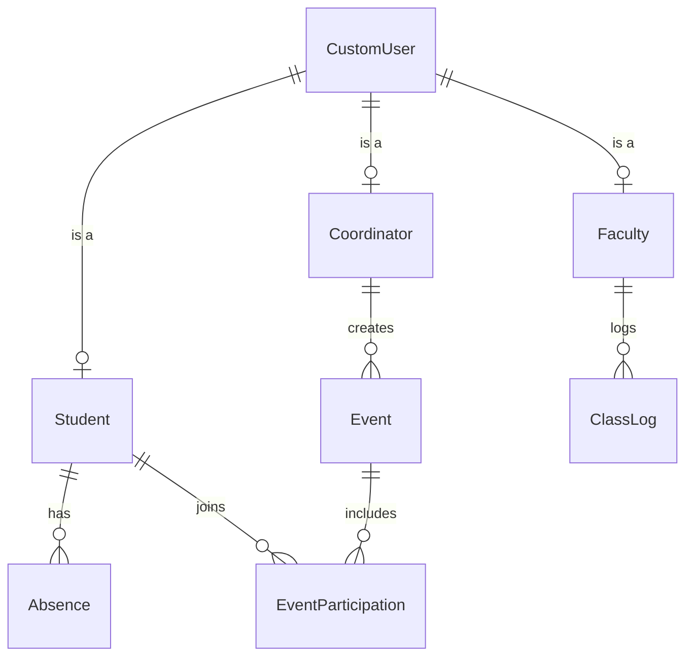

# 📓 ClassBridge — Project Notes

> This file grows as we explore the project. Each section covers a concept in depth.

---

# 📁 FILE: `core/models.py`

## 🔷 Section 1 — The Imports (Lines 1–3)

```python
from django.db import models
from django.contrib.auth.models import AbstractUser
import urllib.parse
```

---

### Import 1️⃣ — `from django.contrib.auth.models import AbstractUser`

#### 🤔 What problem does this solve?

Django already comes with a built-in **User model** (`django.contrib.auth.models.User`).
That User model gives you these fields **for free**:
- `username`
- `password`
- `email`
- `first_name`, `last_name`
- `is_staff`, `is_active`, `is_superuser`
- Login/logout session handling
- Password hashing

**BUT** — the default User model has **no concept of roles** like `student`, `faculty`, or `coordinator`.
We can't just add a `user_type` field to Django's built-in User directly (it's locked inside Django's source code).

#### ✅ Solution: `AbstractUser`

`AbstractUser` is a **base class** provided by Django.
It gives you **everything the default User has**, but lets you **extend it** with your own fields.

Think of it like this:

```
Django's built-in User  ←  AbstractUser  ←  YOUR CustomUser
     (locked)               (open base)        (adds user_type)
```

So when we write:

```python
class CustomUser(AbstractUser):
    user_type = models.CharField(...)
```

We are saying:
> "Give me everything Django's User model already has, AND add a `user_type` field on top of it."

#### 🧠 Why not just use `models.Model` instead?

If we used `models.Model`, we'd have to manually build:
- password hashing
- login/logout
- session tokens
- admin panel integration
- permissions system

That would take hundreds of lines. `AbstractUser` gives all of that for free.

#### 📌 Key Rule
After using `AbstractUser`, you **must** tell Django in `settings.py`:
```python
AUTH_USER_MODEL = 'core.CustomUser'
```
This replaces Django's default User with yours project-wide.

---

### Import 2️⃣ — `import urllib.parse`

#### 🤔 What problem does this solve?

This import is used inside the `ClassLog` model's method `get_ai_video_links()`:

```python
query = urllib.parse.quote(f"{self.subject} {topic} tutorial")
url = f"https://www.youtube.com/results?search_query={query}"
```

**The problem:** When you put text into a URL, special characters **break the URL**.

For example, if a topic is: `"Linked Lists & Recursion"`

A raw URL would look like:
```
https://www.youtube.com/results?search_query=Linked Lists & Recursion tutorial
```
That **space** and **&** will confuse the browser. The URL becomes invalid.

#### ✅ Solution: `urllib.parse.quote()`

`urllib.parse` is Python's **standard library** module for working with URLs.
Its `.quote()` function **encodes** special characters into URL-safe format:

| Original | URL-encoded |
|----------|------------|
| ` ` (space) | `%20` |
| `&` | `%26` |
| `+` | `%2B` |
| `#` | `%23` |

So `"Linked Lists & Recursion tutorial"` becomes:
```
Linked%20Lists%20%26%20Recursion%20tutorial
```

And the final URL becomes perfectly valid:
```
https://www.youtube.com/results?search_query=Linked%20Lists%20%26%20Recursion%20tutorial
```

#### 🧠 Why `urllib.parse` and not something else?

- It's part of Python's **standard library** — no pip install needed.
- It's the industry-standard way to safely build URLs in Python.
- Django itself uses it internally too.

#### 📌 Summary of both imports

| Import | From | Purpose |
|--------|------|---------|
| `AbstractUser` | Django (auth module) | Extend the built-in User model with custom fields |
| `urllib.parse` | Python standard library | Safely encode text into valid YouTube search URLs |

---

## 🔷 Section 2 — Choice Tuples (The "Double" naming)

```python
    USER_TYPE_CHOICES = (
        ('student', 'Student'),
        ('faculty', 'Faculty'),
        ('coordinator', 'Coordinator')
    )
```

### 🤔 Why is each choice written twice?

In Django models, when you use a `choices=` argument, you must provide a **tuple of tuples**. Each inner tuple has exactly two elements:
1. **The DB Value** (Left Side)
2. **The Display Name** (Right Side)

#### 1️⃣ The DB Value (Left Side): `'student'`
- **Where it goes:** This is exactly what is stored in your SQL database table.
- **Why it matters:** It is used for backend logic. For example, if you want to check a user's role in a view:
  ```python
  if user.user_type == 'student':
      # do something
  ```
- **Constraint:** Usually lowercase and no spaces (to be DB-friendly).

#### 2️⃣ The Display Name (Right Side): `'Student'`
- **Where it goes:** This is what appears in the **Django Admin Panel**, dropdown menus, and on the website frontend.
- **Why it matters:** It is the human-friendly version. It can have spaces, capital letters, or special characters.
- **Constraint:** Can be anything that looks good to the end-user.

---

### 🧠 The "Magic" Method: `get_FOO_display()`

Django provides a special method to access the "Human" side easily. If your field is named `user_type`, Django automatically creates:

```python
# In models.py (line 15)
return f"{self.username} ({self.get_user_type_display()})"
```

- `user.user_type` → Returns `'student'` (Raw)
- `user.get_user_type_display()` → Returns `'Student'` (Pretty)

### 📌 Summary Table

| Side | Example | Purpose |
|------|---------|---------|
| **Left** | `'student'` | Database storage & Python Logic (Backend) |
| **Right** | `'Student'` | User Interface & Admin Panel (Frontend) |

---

## 🔷 Section 3 — Visualizing the Database (Architecture)

To understand the models, think of the `CustomUser` as the **trunk** of a tree, and the other models as **branches** that connect to it.



---

## 🔷 Section 4 — Model-by-Model Breakdown

### 1️⃣ `class CustomUser(AbstractUser)`
*This is our master identity model.*

| Line | Code | Result / Explanation |
|:---|:---|:---|
| 5 | `class CustomUser(...)` | Creates the central user table. |
| 6-10 | `USER_TYPE_CHOICES = ...` | Defines the roles (Student, Faculty, Coordinator). |
| 12 | `user_type = models.CharField(...)` | The actual field in DB storing the role. |
| 14-15 | `def __str__(self): ...` | Controls how a user appears in the Admin (e.g., "john_doe (Student)"). |

---

### 2️⃣ The Profile Models (`Faculty`, `Student`, `Coordinator`)
*These "wrap" the CustomUser with extra info relevant to their role.*

#### `class Student(models.Model)`
| Line | Code | Result / Explanation |
|:---|:---|:---|
| 27 | `user = models.OneToOneField(...)` | Connects 1 Student profile to exactly 1 CustomUser. |
| 28 | `related_name='student_profile'` | Let's us do `user.student_profile` to go from User back to Student. |
| 29 | `roll_number = ...` | A unique string identifying the student (e.g., "CS101"). |
| 30 | `batch = ...` | The class group (e.g., "2024-C"). |

> **Note:** `Faculty` and `Coordinator` work exactly like this, but with different fields like `department` or `assigned_batch`.

---

### 3️⃣ `class Event(models.Model)`
*Things happening in the college (Seminars, Workshops, etc.)*

| Line | Code | Result / Explanation |
|:---|:---|:---|
| 47 | `created_by = models.ForeignKey(...)` | Connects the event to the Coordinator who made it. |
| 47 | `on_delete=models.CASCADE` | If the Coordinator is deleted, delete their events too. |

---

### 4️⃣ `class ClassLog(models.Model)`
*The record of what happened in a specific lecture.*

| Line | Code | Result / Explanation |
|:---|:---|:---|
| 55 | `topics_covered = models.TextField()` | Stores a long list of topics (e.g., "Loops, Lists, Recursion"). |
| 62-73 | `def get_ai_video_links(self):` | **The Cool Logic:** It splits the `topics_covered` text and creates automated YouTube URLs for each topic. |

---

### 5️⃣ Interaction Models (`Absence`, `EventParticipation`)
*Tracking what students are doing.*

#### `class EventParticipation(models.Model)`
*The link between a Student and an Event.*

| Line | Code | Result / Explanation |
|:---|:---|:---|
| 88 | `student = models.ForeignKey(...)` | Links one specific participation record to a Student. |
| 89 | `event = models.ForeignKey(...)` | Links it to a specific Event. |
| 95 | `unique_together = ('student', 'event')` | **CRITICAL:** Prevents a student from clicking "Join" 10 times on the same event in the DB. |

---

### 🚀 Key Logic Recap
1. **Inheritance:** We used `AbstractUser` to hijack Django's built-in login system.
2. **OneToOneField:** Used when one thing "is" another (User is a Student).
3. **ForeignKey:** Used when one thing "belongs to" another (Absence belongs to a Student).
4. **Logic in Models:** We kept the YouTube link generator inside the `ClassLog` model so it's reusable everywhere.

---

> ✏️ *More sections will be added as we explore further.*
